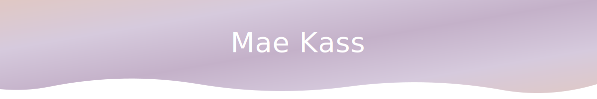
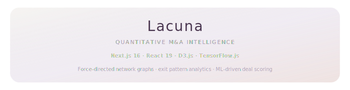
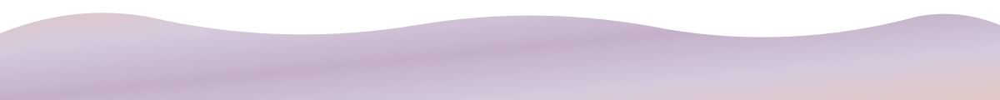

<!--
Keywords: Mae Kass, MPH, investment banking, public equities, emerging markets, early-stage co-investor, healthtech, quantitative finance, ovarian cancer, early detection, maternal mortality, immuno-oncology, precision oncology, genomic solutions, women's sports, female athletic performance, sports science, quantitative analysis, M&A intelligence, machine learning, AI, network visualization, venture capital, women's health, oncology, stochastic modeling, deal scoring, portfolio analytics
-->

<!-- ═══════════════════════════════════════════════════════════ -->
<!-- HEADER — animated wave gradient                            -->
<!-- ═══════════════════════════════════════════════════════════ -->

<picture>
  <source media="(prefers-color-scheme: dark)" srcset="./assets/header-dark.svg" />
  <source media="(prefers-color-scheme: light)" srcset="./assets/header.svg" />
  
</picture>

<!-- ═══════════════════════════════════════════════════════════ -->
<!-- TYPING TAGLINE                                             -->
<!-- ═══════════════════════════════════════════════════════════ -->

  

<!-- ═══════════════════════════════════════════════════════════ -->
<!-- PULL QUOTE — editorial epigraph                            -->
<!-- ═══════════════════════════════════════════════════════════ -->

  

<h3 align="center"><em>"ACL tears, genetic markers, maternal mortality — these are not soft issues. They are quantitatively investable."</em></h3>

  <picture>
    <source media="(prefers-color-scheme: dark)" srcset="./assets/pearl-divider-dark.svg" />
    <source media="(prefers-color-scheme: light)" srcset="./assets/pearl-divider.svg" />
    
  </picture>

<!-- ═══════════════════════════════════════════════════════════ -->
<!-- ABOUT — warm, editorial voice                              -->
<!-- ═══════════════════════════════════════════════════════════ -->

The market has systematically underpriced woman-centric health. I deploy capital where that gap is widest — $2B+ AUM in institutional finance, now 10+ early-stage co-investments across immuno-oncology, precision oncology, and genomic solutions particular to Black women. I make that case in the language capital markets understand.

This focus was shaped by proximity: early detection of ovarian cancer, parental cancer, an MPH investigating maternal mortality and genetic predispositions. That lived expertise sharpens every investment thesis I write and every tool I build.

I built <a href="https://github.com/maekass/Lacuna">Lacuna</a> — an M&A intelligence platform that maps acquirer-target networks, scores deal probability, and surfaces pricing anomalies across healthcare dealflow.

<!-- ═══════════════════════════════════════════════════════════ -->
<!-- SELECTED WORK — film strip border aesthetic                -->
<!-- ═══════════════════════════════════════════════════════════ -->

  

  <a href="https://github.com/maekass/Lacuna">
    <picture>
      <source media="(prefers-color-scheme: dark)" srcset="./assets/glass-card-dark.svg" />
      <source media="(prefers-color-scheme: light)" srcset="./assets/glass-card.svg" />
      
    </picture>
  </a>

  

  

<!-- ═══════════════════════════════════════════════════════════ -->
<!-- FOCUS AREAS — elegant minimal list                         -->
<!-- ═══════════════════════════════════════════════════════════ -->

  <picture>
    <source media="(prefers-color-scheme: dark)" srcset="./assets/pearl-divider-dark.svg" />
    <source media="(prefers-color-scheme: light)" srcset="./assets/pearl-divider.svg" />
    
  </picture>

  <strong>Quantitative Finance</strong>&nbsp;&nbsp;&nbsp;·&nbsp;&nbsp;&nbsp;<strong>Applied AI</strong>&nbsp;&nbsp;&nbsp;·&nbsp;&nbsp;&nbsp;<strong>M&A Intelligence</strong>&nbsp;&nbsp;&nbsp;·&nbsp;&nbsp;&nbsp;<strong>Oncology &amp; Genomics</strong>&nbsp;&nbsp;&nbsp;·&nbsp;&nbsp;&nbsp;<strong>Women's Sport</strong>

  <em>Women's sport: a profoundly undervalued lens for health outcomes — and a compelling investment thesis in its own right.</em>

<!-- ═══════════════════════════════════════════════════════════ -->
<!-- CONTRIBUTION SNAKE                                         -->
<!-- ═══════════════════════════════════════════════════════════ -->

<!--
  Contribution snake animation — auto-generated by GitHub Actions.
  The snake SVGs are created on the `output` branch after the workflow runs.
  To activate: Actions tab → "Generate Snake Animation" → "Run workflow".
  Until then, this section is intentionally empty.
-->

  <picture>
    <source media="(prefers-color-scheme: dark)" srcset="https://raw.githubusercontent.com/maekass/maekass/output/snake-dark.svg" />
    <source media="(prefers-color-scheme: light)" srcset="https://raw.githubusercontent.com/maekass/maekass/output/snake.svg" />
    
  </picture>

<!-- ═══════════════════════════════════════════════════════════ -->
<!-- SIGNATURE                                                  -->
<!-- ═══════════════════════════════════════════════════════════ -->

  

<!-- ═══════════════════════════════════════════════════════════ -->
<!-- CONNECT                                                    -->
<!-- ═══════════════════════════════════════════════════════════ -->

  &nbsp;&nbsp;
  &nbsp;&nbsp;
  

<!-- ═══════════════════════════════════════════════════════════ -->
<!-- FOOTER — animated wave                                     -->
<!-- ═══════════════════════════════════════════════════════════ -->

<picture>
  <source media="(prefers-color-scheme: dark)" srcset="./assets/footer-dark.svg" />
  <source media="(prefers-color-scheme: light)" srcset="./assets/footer.svg" />
  
</picture>
